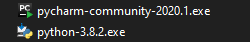

.. Coding Academy documentation master file, created by
   sphinx-quickstart on Sun Apr  5 22:55:20 2020.
   You can adapt this file completely to your liking, but it should at least
   contain the root `toctree` directive.

Warsztat 1
##########

Wszystkie nasze warsztaty będą składały się z części do samodzielnego wykonania i takiej nad którą popracujemy w czasie
zajęć. Do samodzielnego wykonania przed pierwszymi zajęciami są sekcje :ref:`sprzet` i :ref:`jakzbudowac`. Przyjdź na
zajęcia z przygotowanym środowiskiem, aby nie tracić czasu na instalację oprogramowania w czasie zajęć!

.. _sprzet:

Sprzęt - czego potrzebuję?
**************************
Potrzebujesz komputera. Nie musi to być najnowszy model za pięciocyfrową kwotę, natomiast powinien być wystarczająco
wydajny, ale nauka programowania nie powodowała frustracji natury sprzętowej.

Komputer, ale jaki?
===================
Dla naszych potrzeb chyba najlepiej sprawdzi się laptop. Większość maszyn wyprodukowanych po 2010 roku i spełniające
poniższe wymagania powinna być OK.

- **procesor intel i3, i5 lub i7**
- **pamięć operacyjna (RAM)** min. 4GB
- **dysk SSD** - nie jest niezbędny, ale mając go, wszystko będzie działało szybciej
- **Windows 10** - na takim systemie operacyjnym będziemy wykonywać ćwiczenia. Windows 7 lub 8 też da radę.
  Windows XP sie nie nadaje, bo nie zainstalujemy na nim najnowszego pythona!

Sprzęt nie musi być nowy. Jeśli nie masz komputera i zamierzasz go kupić, to dobrym pomysłem może okazać się poszukanie
sprzętu używanego.

.. _jakzbudowac:

Jak zbudować sobie środowisko?
******************************

Tytułem wstępu
==============

Czym jest środowisko? Środowisko, to zainstalowany zestaw oprogramowania, który pozwoli nam pisać i uruchamiać kod.
Aby stworzyć środowisko programistyczne w języku Python potrzebujemy 2 rzeczy. Obie dostępne są za darmo:

- Python - zestaw narzędzi niezbędnych do uruchamiania programów napisanych w Pythonie
  `https://www.python.org <https://www.python.org/ftp/python/3.8.2/python-3.8.2.exe>`_
- PyCharm community - zintegrowane środowisko programistyczne `https://www.jetbrains.com/pycharm
  <https://download.jetbrains.com/python/pycharm-community-2020.1.exe>`_

Opcjonalnie można sobie zainstalować jeszcze 2 rzeczy (nie są niezbędne - przydadzą się w poziomach wyższych niż podstawowy):

- git - oprogramowanie do kontroli wersji `https://git-scm.com/download/win
  <https://github.com/git-for-windows/git/releases/download/v2.26.0.windows.1/Git-2.26.0-64-bit.exe>`_
- sourceTree - przyjazny interfejs użytkownika dla gita `https://sourcetreeapp.com
  <https://product-downloads.atlassian.com/software/sourcetree/windows/ga/SourceTreeSetup-3.3.8.exe>`_

.. note:: Ściągnij wersje instalacyjne oprogramowania korzystając z powyższych linków.
   W dalszej części artykułu pokażę na co zwrócić uwagę przy instalacji.

Po pobraniu powyższych powinniśmy mieć następujące pliki:

No to instalujemy
=================

Python
------
- Uruchamiamy plik **python-3.8.2.exe**
- Na pierwszym ekranie zaznaczamy "Add Python 3.8 to PATH" i wybieramy **Install now**.

   .. figure:: images/python1.png
      :width: 400

   .. note::
      Dobrze jest zapamiętac ścieżkę, w której Python się nam instaluje - przyda się w kolejnych krokach.

      Domyślna ścieżka: **C:\\Users\\<nazwa_usera>\\AppData\\Local\\Programs\\Python\\Python38-32**

- Po udanej instalacji klikamy **Close**.

   .. figure:: images/python2.png
      :width: 400

- Weryfikacja: po poprawnej instalacji wykonanie w Wierszu polecenia:

  ``python --version``

  powinno zwrócić wersję Pythona.

   .. figure:: images/python3.png
      :width: 400

PyCharm
-------
- Uruchamiamy plik **pycharm-community-2020.1.exe**

  .. figure:: images/pycharm1.png
     :width: 400

- Jedyna rzecz, którą zmieniamy podczes instalacji, to zaznaczenie opcji **Create Desktop Shortcut -> 64-bit launcher**

  .. figure:: images/pycharm2.png
     :width: 400

- Po udanej instalacji klikamy **Finish**

  .. figure:: images/pycharm3.png
     :width: 400

- Na desktopie pojawi się ikona.

  .. figure:: images/pycharm4.png

- Uruchamiamy PyCharm. Wybieramy **Do not import settings**

  .. figure:: images/pycharm5.png
     :width: 400

- Wybieramy motyw kolorystyczny i **Next - Featured plugins**

  .. figure:: images/pycharm6.png
     :width: 400

- Tu nic nie zmieniamy i klikamy **Start using PyCharm**.

  .. figure:: images/pycharm7.png
     :width: 400

- Po uruchomieniu PyCharm powinniśmy dostać takie okienko:

  .. figure:: images/pycharm8.png
     :width: 400

Weryfikacja poprawnej instalacji środowiska
===========================================

Nowy projekt
------------

- Uruchamiamy pyCharm i w oknie wybieramy opcję **Create new project**

  .. figure:: images/pycharm8.png
     :width: 400

- Wybieramy nazwę katalogu, gdzie znajdował się będzie nasz kod (Location)
- Rozwijamy sekcję **Project interpreter** i sprawdzamy, czy jest zaznaczona opcja **New environment using Virtualenv**,
  oraz czy w polu **Base interpreter** wskazana jest poprawna ścieżka, w której zainstalowaliśmy Pythona.

  .. figure:: images/pycharm_new_project1.png
     :width: 400

- Klikamy **Create** i czekamy chwilę, aż pyCharm skończy przygotowywać nasz projekt
- Klikamy prawym klawiszem myszy na nazwę projektu (taka sama jak nazwa katalogu, który wskazaliśmy w poprzednim kroku)
- Wybieramy **New -> Python File**

  .. figure:: images/pycharm_new_project2.png
     :width: 400

- Plik, w którym będziemy pisali kod należy nazwać. Wpisujemy nazwę i naciskamy ENTER

  .. figure:: images/pycharm_new_project3.png
     :width: 400

- W prawej części nowy plik zostaje otwarty
- Pora sprawdzić czy to działa. W pliku wpisujemy jedną linię kodu:
  ``print('Hello World')``
- Aby pierwszy raz uruchomić nasz kod klikamy prawym klawiszem w pustej przestrzeni edytora i wybieramy **Run main**

  .. figure:: images/pycharm_new_project4.png
     :width: 400

- W dolnej części okna zobaczymy wynik działania naszego programu

  .. figure:: images/pycharm_new_project5.png
     :width: 400

- Jeśli dotarłeś do tego etapu, to gratuluję! Zainstalowałeś sobie środowisko developerskie.

  .. figure:: images/yoda.jpg
     :width: 400

Załadowanie kodu z repozytorium (opcjonalne)
--------------------------------------------

.. note:: **Wykonanie tej części jest opcjonalne.** Pokazuję tutaj w jaki sposób można zaczytać kod ze zdalnego repozytorium.

- W oknie pyCharm wybieramy opcję **Get from version control**
- W polu URL wpisujemy: **https://github.com/wsiekiera/coding_academy_welcome.git**
- Wybieramy **Clone**

  .. figure:: images/vcs.png
     :width: 400

- W tym momencie do naszego IDE (Integrated Development Environment) zaczytany zostaje fragment kodu, który posłuży nam do sprawdzenia czy wszystko działa.
- Ostatnią rzeczą, którą trzeba zrobić, to wskazać gdzie znajduje się zainstalowany wcześniej interpreter Pythona. A robi się to tak:
- W prawym, dolnym rogu ekranu klimaky w **<No interpreter>** i dalej **Add interpreter**

  .. figure:: images/interpreter1.png
     :width: 400

- Sprawdzamy, czy pole New environment jest zaznaczone, a w polu **Base interpreter** wpisana jest ścieżka do Pythona zapamiętana na początku tego poradnika. Jeśli wszystko się zgadza, klikamy **OK**

  .. figure:: images/interpreter2.png
     :width: 400

- Pora uruchomić nasz kod. Rozwijamy drzewko katalogów po lewej stronie i klikamy 2x na plik main.py. Plik zaczyta się do edytora.

  .. figure:: images/interpreter3.png
     :width: 400

- Klikamy prawym klawiszem na pliku main.py i wybieramy **Run main**

  .. figure:: images/interpreter4.png
     :width: 400

- W terminalu w dolnej części okna powinniśmy zobaczyć efekt działania kodu.

  .. figure:: images/interpreter5.png
     :width: 400

